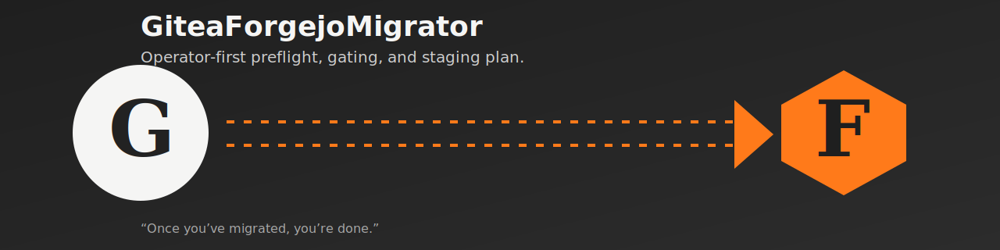

# GiteaForgejoMigrator



Operator-first preflight, gating, and staging plan for **in-place
Gitea → Forgejo migrations**.

> Once you've migrated, you're done. There is no plan for what comes
> after, because there is no "after". This tool exists so a sysadmin
> can ship a Gitea → Forgejo cutover in a single maintenance window,
> validate it, and move on.

---

## Why this tool exists

Most public migration advice assumes either a *greenfield* Forgejo
deployment or a *repo-by-repo* import flow. Neither fits operators who
need to:

- preserve a live Gitea instance in place
- keep SSH and HTTP clone URLs stable
- keep issues, pull requests, attachments, and LFS intact
- avoid blind database surgery
- finish inside a short maintenance window

`GiteaForgejoMigrator` is a **read-only** preflight + planning tool
that produces the artifacts you need to do that cutover safely:

| Artifact                   | From                              | Used by              |
|----------------------------|-----------------------------------|----------------------|
| deployment audit report    | `collect-live` / fixture JSON     | you, your reviewer   |
| readiness evaluation       | `audit`                           | gate / proceed check |
| compatibility gate         | `gate`                            | CI / pre-cutover     |
| backup manifest            | `backup-manifest`                 | `freeze-and-backup` step |
| staged migration plan      | `migration-plan`                  | the runbook          |
| smoke-check shell script   | `smoke-plan`                      | post-cutover validation |
| no-touch dry-run report    | `simulate`                        | you, your reviewer   |

Nothing in this tool **mutates** the source instance.

## Scope

This tool is meant to be portable across common self-hosted Gitea
deployments, but it does **not** claim universal compatibility with every
possible environment. The current alpha explicitly models and tests:

- systemd or Docker-based installs
- PostgreSQL and SQLite backends
- Actions-enabled instances
- LFS-heavy instances
- supported `1.22.x -> Forgejo 10.x -> current Forgejo` staging
- blocked `1.23+ -> current Forgejo` direct-upgrade cohorts

Anything outside those cohorts should be treated as unsupported until a
fixture and validation path are added for it.

## Installation

The tool is a pure-Python package with **no runtime dependencies**.
Python ≥ 3.10 is required.

### Option A — install from GitHub (default)

```bash
pip install "git+https://github.com/joshrfr/gitea-forgejo-migrator.git@v0.1.0-alpha.1"
```

After this, the `gitea-forgejo-migrator` command is on your `$PATH`.

### Option B — install from a local clone

```bash
git clone https://github.com/joshrfr/gitea-forgejo-migrator.git
cd gitea-forgejo-migrator
pip install .
```

## Quick Start

```bash
# 1. Collect a live audit (server-local or with --ssh-target)
gitea-forgejo-migrator collect-live \
    --ssh-target admin@git.example.internal \
    --output ./my-audit.json

# 2. Read-only evaluation against the audit
gitea-forgejo-migrator audit ./my-audit.json

# 3. Gate against the next target version
gitea-forgejo-migrator gate ./my-audit.json --target forgejo-10
gitea-forgejo-migrator gate ./my-audit.json --target forgejo-current

# 4. Generate the artifacts the runbook needs
gitea-forgejo-migrator backup-manifest --audit   ./my-audit.json --output ./backup.json
gitea-forgejo-migrator migration-plan  --audit   ./my-audit.json --output ./plan.json
gitea-forgejo-migrator smoke-plan      --audit   ./my-audit.json --output ./smoke.sh

# 5. Run the no-touch dry-run pipeline
gitea-forgejo-migrator simulate --audit ./my-audit.json --output ./dryrun.json
```

The supported path at the moment is:

```
Gitea 1.22.x  →  Forgejo 10.x  →  current Forgejo
```

The `gate` command will refuse to give you a direct path to current
Forgejo from Gitea 1.23+. This refusal is intentional and matches
upstream Forgejo guidance.

## Admin-Run Path

The intended operator flow is:

1. install the package on the source host
2. run `emit-local-runner`
3. execute the generated wrapper locally
4. review the generated audit, gate, backup, plan, and smoke artifacts

Example:

```bash
pip install "git+https://github.com/joshrfr/gitea-forgejo-migrator.git@v0.1.0-alpha.1"
gitea-forgejo-migrator emit-local-runner \
    --output ./run-preflight.sh \
    --output-dir ./gfm-preflight
./run-preflight.sh
```

The tool does not mutate the source server for you. An admin still has to:

- install the package
- point it at non-standard `app.ini` or data-root paths if needed
- ensure read-only inspection binaries are available
- execute the actual maintenance-window migration steps after reviewing the plan

## Command Surface (alpha)

| Command             | Purpose                                                           |
|---------------------|-------------------------------------------------------------------|
| `compatibility`     | Assess a single Gitea source version                              |
| `audit`             | Evaluate a deployment audit fixture for readiness + risk          |
| `gate`              | Compatibility gate for the next migration target                  |
| `backup-manifest`   | Produce the freeze-and-backup checklist                          |
| `migration-plan`    | Produce a staged migration plan + rollback summary                |
| `smoke-plan`        | Produce a post-cutover smoke-check shell script                  |
| `simulate`          | Run the local no-touch pipeline against a fixture                 |
| `collect-live`      | Read-only audit collected via SSH or on-host shell                |
| `emit-local-runner` | Emit a server-local wrapper the admin runs by hand                |
| `preflight-local`   | Run the audit + plan + smoke pipeline locally on the source host  |

## Compatibility Matrix (alpha)

| Source Gitea  | Allowed next target  | Notes                                    |
|---------------|----------------------|------------------------------------------|
| `1.21.x`      | unsupported in alpha | Needs a fixture + rule (PRs welcome)     |
| `1.22.x`      | `forgejo-10`         | Recommended staging cohort               |
| `1.22.x`      | `forgejo-current`    | **Refused** by `gate`; stage first       |
| `1.23+`       | `forgejo-10`         | Blocked — upstream Gitea 1.23 cutover    |
| `1.23+`       | `forgejo-current`    | Blocked — see `gitea-123-blocked` fixture|

The matrix lives in code at
`tooling/gitea_forgejo_migrator/compatibility.py`. Edge cases
(`docker-audit.json`, `sqlite-audit.json`, `actions-audit.json`,
`lfs-heavy-audit.json`, `gitea-123-blocked-audit.json`) live under
`fixtures/`.

## Design Principles

1. **Audit before mutation.** We never recommend a cutover without
   reading the source instance first.
2. **Refuse unsupported direct paths.** Hard refusals are a feature.
3. **Always produce both app-level and VM-level rollback points.**
4. **Preserve existing paths, secrets, and SSH behavior by default.**
5. **Separate compatibility checks from execution logic.**
6. **Make dry-run the default.** Anything that *would* mutate is a
   separate, opt-in subcommand.
7. **No transport assumptions in product core.** The collector uses a
   generic shell; transport choices belong to the operator.

The CLI is **terminal-only** in alpha. There is no GUI, no daemon, no
agent installed on the source host. The host-local runner script
(`emit-local-runner`) is the one exception, and it is a generated
artifact, not a service.

## Repository Layout

```
.
├── README.md              ← this file
├── CHANGELOG.md
├── CONTRIBUTING.md
├── RELEASING.md
├── LICENSE
├── pyproject.toml
├── setup.cfg
├── MANIFEST.in
├── .gitignore
├── assets/                ← logo + icon + banner + social card (SVG)
├── docs/                  ← runbooks and product direction
├── fixtures/              ← edge-case audit JSONs
├── scripts/               ← read-only transport helpers
├── tests/                 ← pytest suite (61 tests)
└── tooling/gitea_forgejo_migrator/   ← source package
```

## Documentation

- [`docs/MIGRATION_RUNBOOK_VM100.md`](docs/MIGRATION_RUNBOOK_VM100.md)
- [`docs/VM100_AUDIT_2026-06-18.md`](docs/VM100_AUDIT_2026-06-18.md)
- [`docs/LOCAL_EXECUTION.md`](docs/LOCAL_EXECUTION.md)
- [`docs/PRODUCT_ROADMAP.md`](docs/PRODUCT_ROADMAP.md)
- [`docs/FUTURE_PRODUCT_DIRECTION.md`](docs/FUTURE_PRODUCT_DIRECTION.md)

## Tests

```bash
pip install -e ".[dev]"
pytest -q
```

`pytest` runs 61 tests covering audit, compatibility, backup planning,
discovery, pipeline, smoke harness, journal, local runner, CLI
surface, and every fixture in the matrix.

## License

BSD 3-Clause — see [LICENSE](LICENSE).

## Acknowledgements

The **pre-flight contribution questions** in `CONTRIBUTING.md` are
adapted from
[sohaibt/product-mode](https://github.com/sohaibt/product-mode) (MIT,
Sohaib Tanveer), used under the project's purpose of letting small
contributions carry clear rationale.
